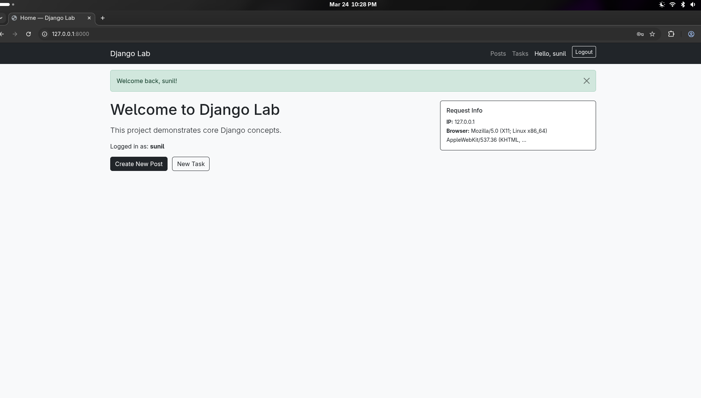
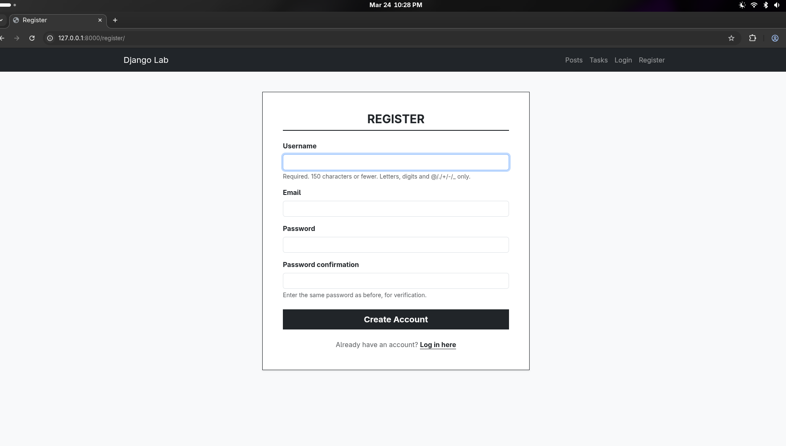
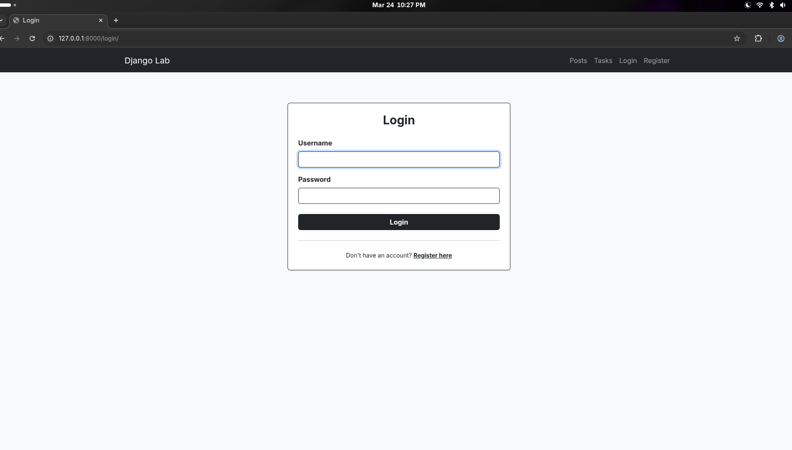
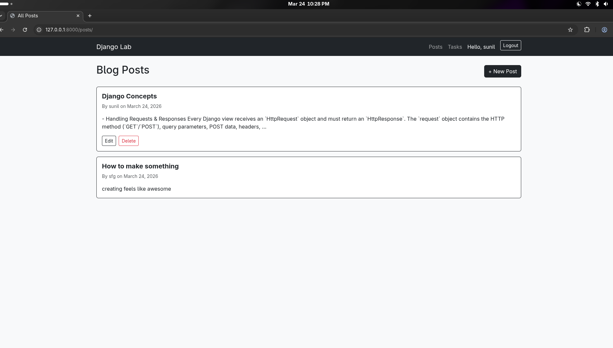
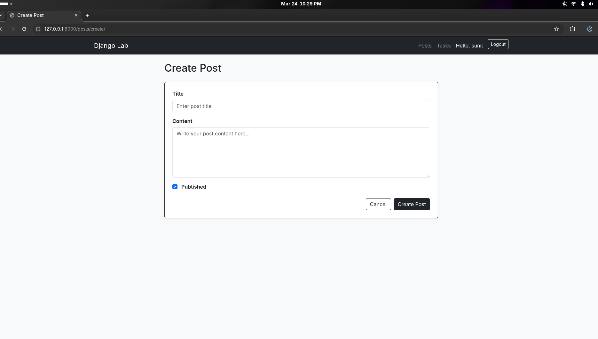
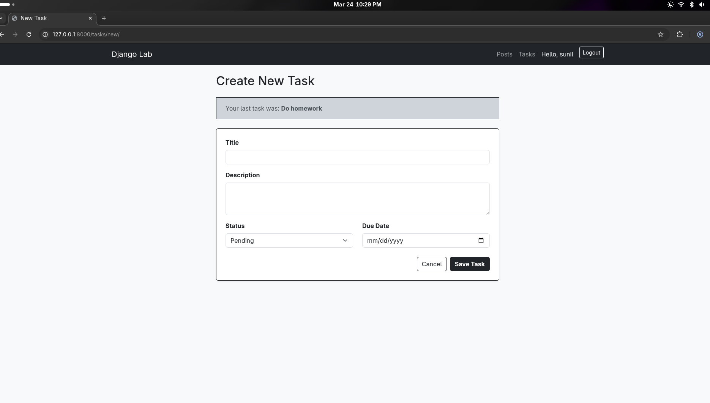
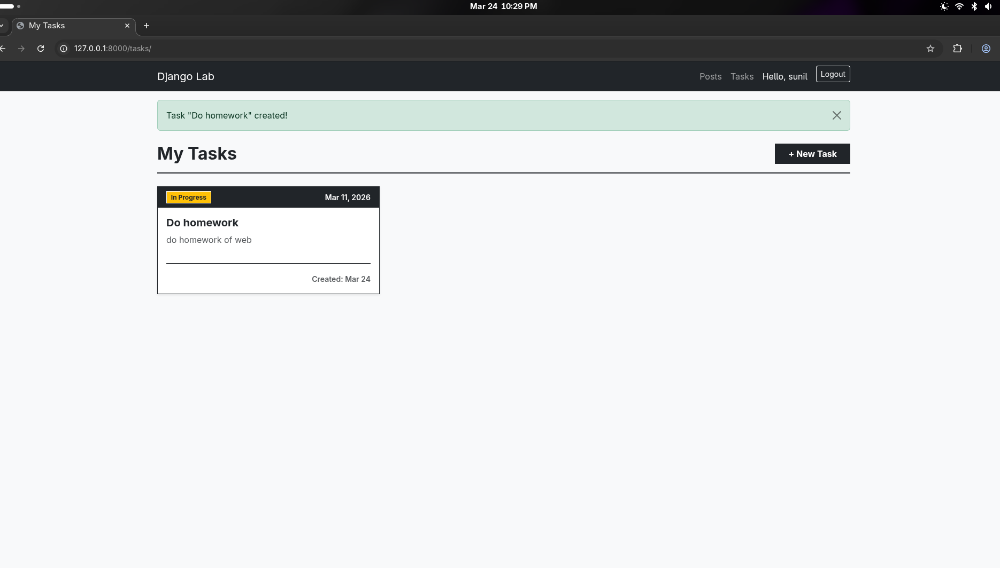

# Lab Report: Django Web Application Core Concepts Implementation

**Name:** Sunil Lamichhane <br>
**Roll:** 080BCT090 <br>
**Subject:** Web Technology <br>
**Lab:** Django Framework — Requests, Forms, Sessions, Routing, Middleware, ORM, Auth <br>

---

## Table of Contents

1. [Brief Description of the Project](#1-brief-description-of-the-project)
2. [MVT Architecture](#2-mvt-architecture)
3. [Project Structure](#3-project-structure)
4. [Code — Major Components](#4-code--major-components)
5. [Concepts Covered](#5-concepts-covered)
6. [GitHub Repository](#6-github-repository)
7. [Output Screenshots](#7-output-screenshots)
8. [Conclusion](#8-conclusion)

---

## 1. Brief Description of the Project

This project is a **Blog & Task Manager Web Application** built with Django. It is designed as a single project that demonstrates all the major concepts of Django development in one place.

The application allows users to:

- Register and log in (Authentication & Authorization)
- Create, read, update, and delete blog posts (CRUD + ORM)
- Submit and manage tasks using forms with session-based feedback
- Navigate across multiple pages via URL routing
- Experience middleware-level logging and error handling transparently

The project uses **SQLite** as its relational database (via Django ORM) and also demonstrates how a **NoSQL** (MongoDB via `djongo` or `pymongo`) integration would be structured for comparison.

**Tech Stack:**

- Python 3.11
- Django 4.2
- SQLite (Relational)
- MongoDB (NoSQL — conceptual integration shown)
- Bootstrap 5 (for templates)

---

## 2. MVT Architecture

Django follows the **MVT (Model-View-Template)** pattern, which is Django's interpretation of the classic MVC pattern.

```
Request
  │
  ▼
urls.py  ──────────────────────────────────────────────────►  404 Handler
  │ (URL Router — maps URL to View)
  ▼
middleware.py
  │ (Logging, Security, Session, Auth checks)
  ▼
views.py  (Controller logic)
  │        │
  │        ▼
  │      models.py  ◄──────►  Database (SQLite / MongoDB)
  │      (ORM queries)
  │
  ▼
templates/  (HTML rendered with context data)
  │
  ▼
Response → Browser
```

| MVT Layer      | Django Component   | Responsibility                                                         |
| -------------- | ------------------ | ---------------------------------------------------------------------- |
| **Model**      | `models.py`        | Defines data structure, handles DB operations via ORM                  |
| **View**       | `views.py`         | Handles request logic, processes forms, calls models, returns response |
| **Template**   | `templates/*.html` | Renders the HTML with data passed from the view                        |
| **URL Router** | `urls.py`          | Maps incoming URL patterns to the correct view function                |
| **Middleware** | `middleware.py`    | Intercepts every request/response for logging, auth, security          |

**Difference from MVC:**
In classic MVC, the Controller handles routing and logic. In Django's MVT, the **View** acts as the controller, the **Template** acts as the View (presentation), and the URL router acts as the dispatcher.

---

## 3. Project Structure

```
django_lab/
│
├── manage.py
├── django_lab/                  # Project config
│   ├── __init__.py
│   ├── settings.py
│   ├── urls.py
│   └── wsgi.py
│
├── blog/                        # Main app
│   ├── __init__.py
│   ├── models.py                # Post, Task models (ORM)
│   ├── views.py                 # All view functions
│   ├── forms.py                 # Django Forms
│   ├── urls.py                  # App-level URL patterns
│   ├── middleware.py            # Custom middleware
│   ├── admin.py                 # Admin registration
│   └── templates/
│       └── blog/
│           ├── base.html        # Base layout
│           ├── home.html        # Home page
│           ├── post_list.html   # All posts
│           ├── post_detail.html # Single post
│           ├── post_form.html   # Create/edit post
│           ├── task_form.html   # Task form with session
│           ├── login.html       # Login page
│           └── register.html    # Register page
│
├── static/                      # CSS, JS, images
├── db.sqlite3                   # SQLite database (auto-created)
└── requirements.txt
```

---

## 4. Code — Major Components
 > Please download or see `Lab Report 080BCT090 Django.pdf` file under this repository for full information.

---

## 5. Concepts Covered

### Handling Requests & Responses

Every Django view receives an `HttpRequest` object and must return an `HttpResponse`. The `request` object contains the HTTP method (`GET`/`POST`), query parameters, POST data, headers, session, and the authenticated user. Views return responses using `render()` for HTML, `redirect()` for URL redirects, or `JsonResponse()` for API responses.

### Form Data Handling & Sessions

Django Forms (`forms.ModelForm`) automate field rendering, validation, and data cleaning. On `POST`, `form.is_valid()` runs all validators. Sessions (`request.session`) persist key-value data server-side between requests, identified by a cookie sent to the browser. This is used for login state, flash messages, and storing temporary data like the last submitted task.

### Routing

URL routing in `urls.py` maps URL patterns to views using `path()`. App-level `urls.py` files keep routing modular. Named URLs (e.g., `name='post_detail'`) allow templates and views to reference URLs symbolically using ``, so URLs can be changed in one place without breaking references.

### Middleware

Middleware is a chain of hooks that wraps every request and response. Django applies middleware in the order listed in `settings.MIDDLEWARE`. Custom middleware classes implement `__call__` to intercept requests before and after views, enabling centralized logging, authentication guards, and security header injection.

### Templating

Django templates use `{{ variable }}` for output and `` for logic. Templates extend a base layout using `` and ``, promoting DRY (Don't Repeat Yourself) design. Template filters like `|date`, `|truncatewords`, and `|truncatechars` format data for display.

### Database Integration — ORM vs NoSQL

Django ORM maps Python model classes to relational database tables. Queries are written in Python (`Post.objects.filter(...)`) and translated to SQL automatically. This provides database portability and prevents SQL injection. The `models.py` code also shows the equivalent raw MongoDB/pymongo operations to contrast the document-oriented NoSQL approach with the relational ORM approach.

### Authentication & Authorization

Django's built-in auth system (`django.contrib.auth`) handles user creation, password hashing (PBKDF2), login sessions, and the `@login_required` decorator for view-level access control. `authenticate()` verifies credentials, `login()` creates a session, and `logout()` destroys it. The `LoginRequiredMiddleware` adds route-level protection globally.

### Cookies & Sessions

When a user logs in, Django creates a session record in the database and sends a `sessionid` cookie to the browser. On every subsequent request, Django reads this cookie, looks up the session, and attaches the user object to `request.user`. Session cookies are configured to be `HttpOnly` and `Secure` in settings.

---

## 6.Running Locally

**To run the project locally:**

```bash
# Clone the repository
git clone https://github.com/indeedSunil/django-project-web-lab.git
cd django-lab

# Create virtual environment
python -m venv venv
source venv/bin/activate       # On Windows: venv\Scripts\activate

# Install dependencies
pip install django django-bootstrap-v5

# Apply migrations
python manage.py migrate

# Create superuser (for admin panel)
python manage.py createsuperuser

# Run development server
python manage.py runserver
```

---

## 7. Output Screenshots

**Screenshot 1 — Home Page**



**Screenshot 2 — User Registration**



**Screenshot 3 — Login Page**



**Screenshot 4 — Blog Post List**



**Screenshot 5 — Create Post Form**



**Screenshot 6 — Create TaskForm**



**Screenshot 7 — Task Form with Session Data**



---

## 8. Conclusion

This lab successfully demonstrated the core pillars of Django web development in a single cohesive project.
